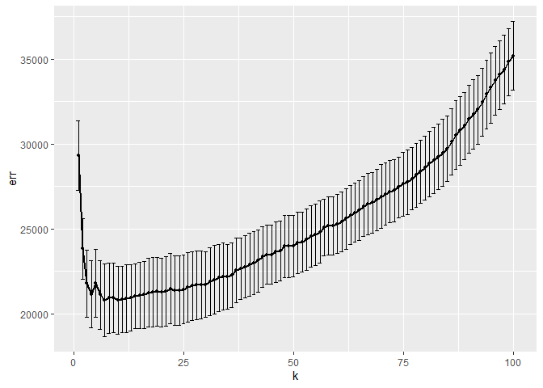
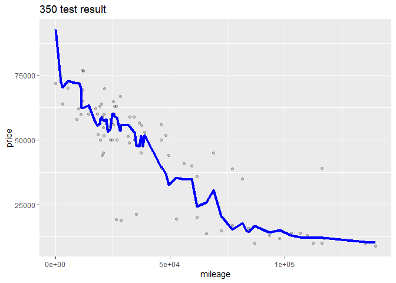
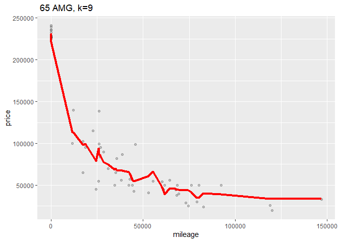

Author:

Jyun\_Yu\_Cheng

Li\_Zhao\_Du

Yi\_Ji\_Gao

question 1
----------

calculate the average departure delay time over 2008 and make a plot to
show that

we can see the result that in most time, the delay time flactulate
between 0 and 20 minutes, and around Oct, the delay time is relatively
small, around 5 minutes.

next we try to calculate the average delay time base on average day, to
reduce unnecessary trouble, we calculate the average delay time by hour

we can find from 6am, the average delay time is increased in general,
and due to schedule arrangement, there is no flight departure between 00
and 06

so we give a suggestion: try to catch earlier flight rather than later
flight

We finally analyzed the relationship between delay time and airlines.
First, we selected airlines with more than 50 flights, and then
calculated their average delay time according to their Time scheduled
departure time.

from that plot we can see that overall, US airline has the minimum delay
time, but we lack their data in some months or some time intervals,
maybe they doesn’t arrange flight line during these conditions.

question 2
----------

part\_A Make a table of the top 10 most popular songs since 1958, as
measured by the total number of weeks that a song spent on the Billboard
Top 100.

we get the result:

<table>
<thead>
<tr class="header">
<th style="text-align: left;">performer</th>
<th style="text-align: left;">song</th>
<th style="text-align: right;">count</th>
</tr>
</thead>
<tbody>
<tr class="odd">
<td style="text-align: left;">Imagine Dragons</td>
<td style="text-align: left;">Radioactive</td>
<td style="text-align: right;">87</td>
</tr>
<tr class="even">
<td style="text-align: left;">AWOLNATION</td>
<td style="text-align: left;">Sail</td>
<td style="text-align: right;">79</td>
</tr>
<tr class="odd">
<td style="text-align: left;">Jason Mraz</td>
<td style="text-align: left;">I’m Yours</td>
<td style="text-align: right;">76</td>
</tr>
<tr class="even">
<td style="text-align: left;">The Weeknd</td>
<td style="text-align: left;">Blinding Lights</td>
<td style="text-align: right;">76</td>
</tr>
<tr class="odd">
<td style="text-align: left;">LeAnn Rimes</td>
<td style="text-align: left;">How Do I Live</td>
<td style="text-align: right;">69</td>
</tr>
<tr class="even">
<td style="text-align: left;">LMFAO Featuring Lauren Bennett &amp; GoonRock</td>
<td style="text-align: left;">Party Rock Anthem</td>
<td style="text-align: right;">68</td>
</tr>
<tr class="odd">
<td style="text-align: left;">OneRepublic</td>
<td style="text-align: left;">Counting Stars</td>
<td style="text-align: right;">68</td>
</tr>
<tr class="even">
<td style="text-align: left;">Adele</td>
<td style="text-align: left;">Rolling In The Deep</td>
<td style="text-align: right;">65</td>
</tr>
<tr class="odd">
<td style="text-align: left;">Jewel</td>
<td style="text-align: left;">Foolish Games/You Were Meant For Me</td>
<td style="text-align: right;">65</td>
</tr>
<tr class="even">
<td style="text-align: left;">Carrie Underwood</td>
<td style="text-align: left;">Before He Cheats</td>
<td style="text-align: right;">64</td>
</tr>
</tbody>
</table>

from the table we can get top 10 most popular songs since 1958

partB Is the “musical diversity” of the Billboard Top 100 changing over
time?

we first excludes the years 1958 and 2021 then we can counts the number
of times that a given song appears on the Top 100 in a given year

    ## # A tibble: 34,467 x 3
    ## # Groups:   year [62]
    ##     year song                                       count
    ##    <int> <chr>                                      <int>
    ##  1  1959 "\"Yep!\""                                     9
    ##  2  1959 "('til) I Kissed You"                         16
    ##  3  1959 "(All of a Sudden) My Heart Sings"            15
    ##  4  1959 "(I'll Be With You In) Apple Blossom Time"    11
    ##  5  1959 "(I Don't Care) Only Love Me"                  4
    ##  6  1959 "(I Wanna) Dance With The Teacher"             3
    ##  7  1959 "(If You Cry) True Love, True Love"            9
    ##  8  1959 "(New In) The Ways Of Love"                    7
    ##  9  1959 "(Night Time Is) The Right Time"               1
    ## 10  1959 "(Now and Then There's) A Fool Such As I"     15
    ## # ... with 34,457 more rows

then we count the number of unique songs that appeared on the Top 100 in
each year, irrespective of how many times it had appeared.

partC: “ten-week hit” as a single song that appeared on the Billboard
Top 100 for at least ten weeks. we first find performer and music
satisfy ten-week hit, then filter people who have less than 30 songs

we can get the plot like:

question 3
----------

partA the 95th percentile of heights for female competitors across all
Athletics events

so we get 95 percentile height of each event and overall separately:

    ## 95% 
    ## 183

    ## # A tibble: 20 x 2
    ##    event                                       ninety_fifth_percentile_height
    ##    <chr>                                                                <dbl>
    ##  1 Athletics Women's Shot Put                                            192.
    ##  2 Athletics Women's Heptathlon                                          189.
    ##  3 Athletics Women's Discus Throw                                        188.
    ##  4 Athletics Women's High Jump                                           188 
    ##  5 Athletics Women's Triple Jump                                         187.
    ##  6 Athletics Women's Javelin Throw                                       186.
    ##  7 Athletics Women's Hammer Throw                                        184.
    ##  8 Athletics Women's Pole Vault                                          183 
    ##  9 Athletics Women's 400 metres Hurdles                                  181.
    ## 10 Athletics Women's Long Jump                                           181.
    ## 11 Athletics Women's 200 metres                                          180 
    ## 12 Athletics Women's 400 metres                                          180 
    ## 13 Athletics Women's 100 metres                                          180.
    ## 14 Athletics Women's Pentathlon                                          179 
    ## 15 Athletics Women's 4 x 400 metres Relay                                178 
    ## 16 Athletics Women's 3,000 metres Steeplechase                           177.
    ## 17 Athletics Women's 100 metres Hurdles                                  176 
    ## 18 Athletics Women's 4 x 100 metres Relay                                176 
    ## 19 Athletics Women's 800 metres                                          176.
    ## 20 Athletics Women's 80 metres Hurdles                                   175.

The 95th percentile of heights for female competitors across all
Athletics events is 183

Partb greatest variability in competitor’s heights

    ## # A tibble: 1 x 2
    ##   event                      height_var
    ##   <chr>                           <dbl>
    ## 1 Rowing Women's Coxed Fours       10.9

Rowing Women’s Coxed Fours had the greatest variability in competitor’s
heights across the entire history of the Olympics, as measured by the
standard deviation

partc average age of Olympic swimmers changed over time

according to data frame, we can also see this trend

    ## # A tibble: 46 x 3
    ## # Groups:   year [28]
    ##     year sex   age_avg
    ##    <int> <chr>   <dbl>
    ##  1  1900 M        18  
    ##  2  1904 M        20.1
    ##  3  1906 M        22  
    ##  4  1908 M        23.5
    ##  5  1912 M        27  
    ##  6  1920 M        26  
    ##  7  1924 F        18  
    ##  8  1924 M        32  
    ##  9  1928 M        23.5
    ## 10  1932 M        19  
    ## # ... with 36 more rows

The average age of Olympic swimmers increased over time. The trend look
different for male swimmers relative to female swimmers

question 4
----------

\#\#\#1 Filter 350 & 65 AMG

\#\#\#2 spilt to test& training set

\#\#\#3 run k nearest neighbors RMSEs

    ## Warning: executing %dopar% sequentially: no parallel backend registered

    ##          k      err  std_err
    ## result.1 1 13593.57 573.1390
    ## result.2 2 11675.46 539.2404
    ## result.3 3 11075.46 382.3186
    ## result.4 4 10736.26 310.1723
    ## result.5 5 10575.33 321.5964
    ## result.6 6 10225.49 330.6022

    ##          k      err  std_err
    ## result.1 1 29327.89 2064.075
    ## result.2 2 23840.60 1784.914
    ## result.3 3 21788.25 1979.042
    ## result.4 4 21155.26 1981.973
    ## result.5 5 21794.79 2002.342
    ## result.6 6 21121.85 2008.562

\#\#\#4 the relationship for RMSE and k，can find optimal k（line or
point）

Then we try to find the optimal k for each trim

so the optimal k for trim 350 and its RMSE is:

    ## [1] 11

    ## [1] 9075.031

so the optimal k for trim 65\_AUG and its RMSE is:

    ## [1] 10

    ## [1] 20645.52

then we fit the model to the training set and make predictions on your
test set

so the out-of-sample root mean-squared error (RMSE) for trim 350 is and
its fitting graph is:

    ## [1] 10785.48

so the out-of-sample root mean-squared error (RMSE) for trim 350 is and
its fitting graph is:

    ## [1] 15897.91

350 trim has a bigger optimal value of k.

Because 65 AMG trim has smaller data size compare to 350 trim level.
fewer observations.On the other hand, smaller estimation variance
generally requires a less complex model, small bias generally requires a
more complex model.And when sample size is smaller, our setting k
progress would be affected, in general we need set smaller k if its data
size is smaller.
