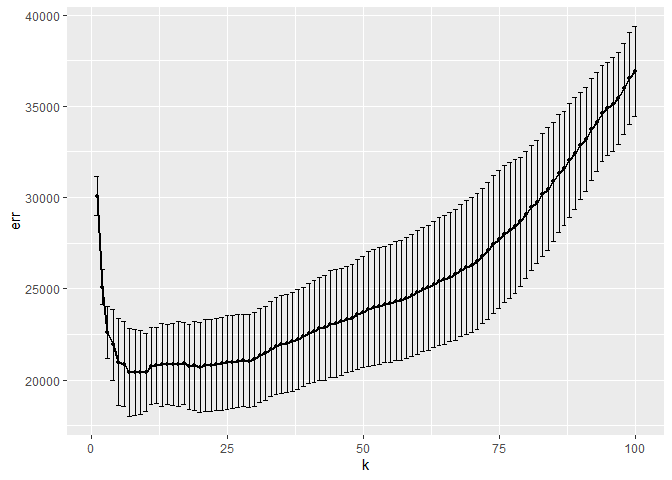
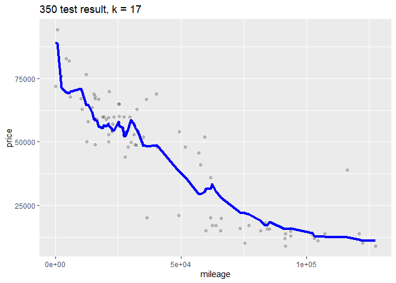
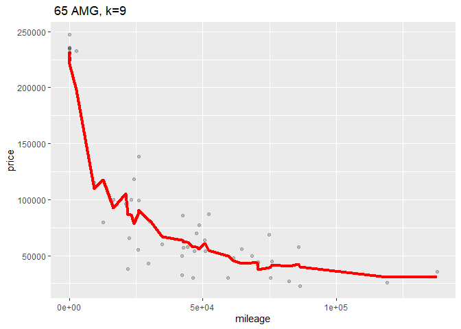

Author:

Jyun\_Yu\_Cheng

Li\_Zhao\_Du

Yi\_Ji\_Gao

question 1
----------

calculate the average departure delay time over 2008 and make a plot to
show that

we can see the result that in most time, the delay time flactulate
between 0 and 20 minutes, and around Oct, the delay time is relatively
small, around 5 minutes.

next we try to calculate the average delay time base on average day, to
reduce unnecessary trouble, we calculate the average delay time by hour

we can find from 6am, the average delay time is increased in general,
and due to schedule arrangement, there is no flight departure between 00
and 06

so we give a suggestion: try to catch earlier flight rather than later
flight

We finally analyzed the relationship between delay time and airlines.
First, we selected airlines with more than 50 flights, and then
calculated their average delay time according to their Time scheduled
departure time.

from that plot we can see that overall, US airline has the minimum delay
time, but we lack their data in some months or some time intervals,
maybe they doesn’t arrange flight line during these conditions.

question 2
----------

part\_A Make a table of the top 10 most popular songs since 1958, as
measured by the total number of weeks that a song spent on the Billboard
Top 100.

we get the result:

    ## # A tibble: 10 x 3
    ## # Groups:   performer [10]
    ##    performer                              song                             count
    ##    <chr>                                  <chr>                            <int>
    ##  1 Imagine Dragons                        Radioactive                         87
    ##  2 AWOLNATION                             Sail                                79
    ##  3 Jason Mraz                             I'm Yours                           76
    ##  4 The Weeknd                             Blinding Lights                     76
    ##  5 LeAnn Rimes                            How Do I Live                       69
    ##  6 LMFAO Featuring Lauren Bennett & Goon~ Party Rock Anthem                   68
    ##  7 OneRepublic                            Counting Stars                      68
    ##  8 Adele                                  Rolling In The Deep                 65
    ##  9 Jewel                                  Foolish Games/You Were Meant Fo~    65
    ## 10 Carrie Underwood                       Before He Cheats                    64

from the table we can get top 10 most popular songs since 1958

partB Is the “musical diversity” of the Billboard Top 100 changing over
time?

we first excludes the years 1958 and 2021 then we can counts the number
of times that a given song appears on the Top 100 in a given year

    ## # A tibble: 34,467 x 3
    ## # Groups:   year [62]
    ##     year song                                       count
    ##    <int> <chr>                                      <int>
    ##  1  1959 "\"Yep!\""                                     9
    ##  2  1959 "('til) I Kissed You"                         16
    ##  3  1959 "(All of a Sudden) My Heart Sings"            15
    ##  4  1959 "(I'll Be With You In) Apple Blossom Time"    11
    ##  5  1959 "(I Don't Care) Only Love Me"                  4
    ##  6  1959 "(I Wanna) Dance With The Teacher"             3
    ##  7  1959 "(If You Cry) True Love, True Love"            9
    ##  8  1959 "(New In) The Ways Of Love"                    7
    ##  9  1959 "(Night Time Is) The Right Time"               1
    ## 10  1959 "(Now and Then There's) A Fool Such As I"     15
    ## # ... with 34,457 more rows

then we count the number of unique songs that appeared on the Top 100 in
each year, irrespective of how many times it had appeared.

partC: “ten-week hit” as a single song that appeared on the Billboard
Top 100 for at least ten weeks. we first find performer and music
satisfy ten-week hit, then filter people who have less than 30 songs

we can get the plot like:

\#\# question 3

partA the 95th percentile of heights for female competitors across all
Athletics events

so we get 95 percentile height of each event and overall separately:

    ## 95% 
    ## 183

    ## # A tibble: 27 x 2
    ##    event                                ninety_fifth_percentile_height
    ##    <chr>                                                         <dbl>
    ##  1 Athletics Women's Shot Put                                     192.
    ##  2 Athletics Women's Heptathlon                                   189.
    ##  3 Athletics Women's Discus Throw                                 188.
    ##  4 Athletics Women's High Jump                                    188 
    ##  5 Athletics Women's Triple Jump                                  187.
    ##  6 Athletics Women's Javelin Throw                                186.
    ##  7 Athletics Women's Hammer Throw                                 184.
    ##  8 Athletics Women's Pole Vault                                   183 
    ##  9 Athletics Women's 400 metres Hurdles                           181.
    ## 10 Athletics Women's Long Jump                                    181.
    ## # ... with 17 more rows

The 95th percentile of heights for female competitors across all
Athletics events is 183

Partb greatest variability in competitor’s heights

    ## # A tibble: 1 x 2
    ##   event                      height_var
    ##   <chr>                           <dbl>
    ## 1 Rowing Women's Coxed Fours       10.9

Rowing Women’s Coxed Fours had the greatest variability in competitor’s
heights across the entire history of the Olympics, as measured by the
standard deviation

partc average age of Olympic swimmers changed over time

The average age of Olympic swimmers increased over time. The trend look
different for male swimmers relative to female swimmers

question 4
----------

\#\#\#1 Filter 350 & 65 AMG

\#\#\#2 spilt to test& training set

\#\#\#3 run k nearest neighbors RMSEs

    ## [1] 8766.9

    ## [1] 37716.33

    ##    id trim subTrim condition isOneOwner mileage year  color displacement   fuel
    ## 1 282  350    unsp       CPO          f   21929 2012  Black        3.0 L Diesel
    ## 2 284  350    unsp       CPO          f   17770 2012 Silver        3.0 L Diesel
    ## 3 285  350    unsp      Used          f   29108 2012  Black        3.0 L Diesel
    ## 4 288  350    unsp       CPO          f   35004 2013  White        3.0 L Diesel
    ## 5 289  350    unsp      Used          t   66689 2012  Black        3.0 L Diesel
    ## 6 290  350    unsp       CPO          f   19567 2012  Black        3.0 L Diesel
    ##   state region   soundSystem wheelType wheelSize featureCount price fold_id
    ## 1    MA    New          unsp      unsp      unsp           82 55994       3
    ## 2    IL    ENC       Premium     Alloy      unsp           72 60900       5
    ## 3    VA    SoA          unsp      unsp      unsp            5 54995       2
    ## 4    NH    New Harman Kardon      unsp      unsp           83 59988       4
    ## 5    NJ    Mid Harman Kardon     Alloy      unsp           79 37995       1
    ## 6    LA    WSC       Premium     Alloy      unsp           76 59977       3

    ##     id   trim subTrim condition isOneOwner mileage year  color displacement
    ## 1 1060 65 AMG    unsp       New          f     106 2015  Black        6.0 L
    ## 2 1062 65 AMG    unsp       New          f      11 2015  Black        6.0 L
    ## 3 1387 65 AMG    unsp      Used          f   74461 2006 Silver        6.0 L
    ## 4 2068 65 AMG    unsp      Used          f   73415 2007   Gray        6.0 L
    ## 5 2141 65 AMG    unsp       CPO          f   17335 2011  Black        6.0 L
    ## 6 2310 65 AMG    unsp       New          f       7 2015  White        6.0 L
    ##       fuel state region soundSystem wheelType wheelSize featureCount  price
    ## 1 Gasoline    NJ    Mid     Premium     Alloy      unsp           73 235375
    ## 2 Gasoline    CA    Pac     Premium      unsp        20           83 226465
    ## 3 Gasoline    IL    ENC        unsp     Alloy      unsp           50  24995
    ## 4 Gasoline    CA    Pac     Premium      unsp      unsp           17  54981
    ## 5 Gasoline    OH    ENC        unsp      unsp      unsp           92 102500
    ## 6 Gasoline    CA    Pac        unsp      unsp      unsp            1 230860
    ##   fold_id
    ## 1       3
    ## 2       2
    ## 3       3
    ## 4       4
    ## 5       3
    ## 6       4

    ## Warning: executing %dopar% sequentially: no parallel backend registered

    ##          k      err  std_err
    ## result.1 1 13768.32 281.5668
    ## result.2 2 12010.59 558.2679
    ## result.3 3 11323.97 576.4579
    ## result.4 4 11201.95 556.7702
    ## result.5 5 10828.79 578.0660
    ## result.6 6 10611.76 588.8118

    ##          k      err  std_err
    ## result.1 1 29675.74 2032.202
    ## result.2 2 25335.56 1816.294
    ## result.3 3 23309.32 1422.852
    ## result.4 4 22402.35 1466.851
    ## result.5 5 22732.51 1428.089
    ## result.6 6 21886.99 1404.297

\#\#\#4 the relationship for RMSE and k，can find optimal k（line or
point）

The optimal k for 350 is 15, and the optimal k for 65 AMG is 22

\#\#\#5 model for each k (for each trim) \#\#6 Which trim have bigger
optimal k? why?

    ## [1] 10751.57

    ## [1] 34050.52

65 AMG has a bigger optimal value of k.

Because 65 AMG trim has more data than 350 trim level.
