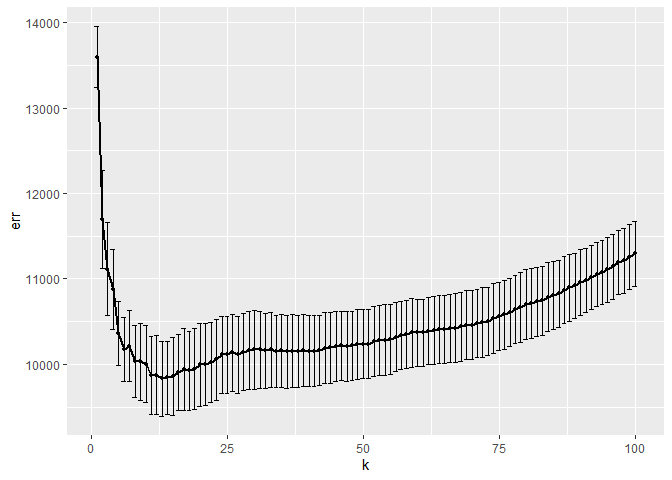

## question 1

calculate the average departure delay time over 2008 and make a plot to
show that

we can see the result that in most time, the delay time fluctulate
between 0 and 20, and around Oct, the delay time is relatively small.

we can find from 6am, the average delay time is increased in general,
and due to schedule arrangement, there is no flight delarture between 00
and 06

so we give a suggestion: try to catch earlier flight rather than later
flight

from that plot we can see that overall, US airline has the minimum delay
time, but we lack their data in some months, maybe they doesn’t arrange
flightline during these months

## question 2

    ## # A tibble: 10 × 3
    ## # Groups:   performer [10]
    ##    performer                                 song                          count
    ##    <chr>                                     <chr>                         <int>
    ##  1 Imagine Dragons                           Radioactive                      87
    ##  2 AWOLNATION                                Sail                             79
    ##  3 Jason Mraz                                I'm Yours                        76
    ##  4 The Weeknd                                Blinding Lights                  76
    ##  5 LeAnn Rimes                               How Do I Live                    69
    ##  6 LMFAO Featuring Lauren Bennett & GoonRock Party Rock Anthem                68
    ##  7 OneRepublic                               Counting Stars                   68
    ##  8 Adele                                     Rolling In The Deep              65
    ##  9 Jewel                                     Foolish Games/You Were Meant…    65
    ## 10 Carrie Underwood                          Before He Cheats                 64

from the table we can get top 10 most popular songs since 1958

partB

we first excludes the years 1958 and 2021 then we can counts the number
of times that a given song appears on the Top 100 in a given year

    ## # A tibble: 34,467 × 3
    ## # Groups:   year [62]
    ##     year song                                               count
    ##    <int> <chr>                                              <int>
    ##  1  1959 "¿Dònde Està Santa Claus? (Where Is Santa Claus?)"     1
    ##  2  1959 "\"Yep!\""                                             9
    ##  3  1959 "('til) I Kissed You"                                 16
    ##  4  1959 "(All of a Sudden) My Heart Sings"                    15
    ##  5  1959 "(I Don't Care) Only Love Me"                          4
    ##  6  1959 "(I Wanna) Dance With The Teacher"                     3
    ##  7  1959 "(I'll Be With You In) Apple Blossom Time"            11
    ##  8  1959 "(If You Cry) True Love, True Love"                    9
    ##  9  1959 "(New In) The Ways Of Love"                            7
    ## 10  1959 "(Night Time Is) The Right Time"                       1
    ## # … with 34,457 more rows

then we count the number of unique songs that appeared on the Top 100 in
each year, irrespective of how many times it had appeared.

partC “ten-week hit” as a single song that appeared on the Billboard Top
100 for at least ten weeks. we first find performer and music satisfy
ten-week hit, then filter people who have less than 30 songs

we can get the plot like:

# question4

##1 Filter 350 & 65 AMG

##2 spilt to test& training set

##3 run k nearest neighbors RMSEs

    ## [1] 10976.61

    ## [1] 40382.82

    ##    id trim subTrim condition isOneOwner mileage year  color displacement   fuel
    ## 1 282  350    unsp       CPO          f   21929 2012  Black        3.0 L Diesel
    ## 2 284  350    unsp       CPO          f   17770 2012 Silver        3.0 L Diesel
    ## 3 285  350    unsp      Used          f   29108 2012  Black        3.0 L Diesel
    ## 4 288  350    unsp       CPO          f   35004 2013  White        3.0 L Diesel
    ## 5 289  350    unsp      Used          t   66689 2012  Black        3.0 L Diesel
    ## 6 290  350    unsp       CPO          f   19567 2012  Black        3.0 L Diesel
    ##   state region   soundSystem wheelType wheelSize featureCount price fold_id
    ## 1    MA    New          unsp      unsp      unsp           82 55994       3
    ## 2    IL    ENC       Premium     Alloy      unsp           72 60900       2
    ## 3    VA    SoA          unsp      unsp      unsp            5 54995       2
    ## 4    NH    New Harman Kardon      unsp      unsp           83 59988       2
    ## 5    NJ    Mid Harman Kardon     Alloy      unsp           79 37995       5
    ## 6    LA    WSC       Premium     Alloy      unsp           76 59977       5

    ##     id   trim subTrim condition isOneOwner mileage year  color displacement
    ## 1 1060 65 AMG    unsp       New          f     106 2015  Black        6.0 L
    ## 2 1062 65 AMG    unsp       New          f      11 2015  Black        6.0 L
    ## 3 1387 65 AMG    unsp      Used          f   74461 2006 Silver        6.0 L
    ## 4 2068 65 AMG    unsp      Used          f   73415 2007   Gray        6.0 L
    ## 5 2141 65 AMG    unsp       CPO          f   17335 2011  Black        6.0 L
    ## 6 2310 65 AMG    unsp       New          f       7 2015  White        6.0 L
    ##       fuel state region soundSystem wheelType wheelSize featureCount  price
    ## 1 Gasoline    NJ    Mid     Premium     Alloy      unsp           73 235375
    ## 2 Gasoline    CA    Pac     Premium      unsp        20           83 226465
    ## 3 Gasoline    IL    ENC        unsp     Alloy      unsp           50  24995
    ## 4 Gasoline    CA    Pac     Premium      unsp      unsp           17  54981
    ## 5 Gasoline    OH    ENC        unsp      unsp      unsp           92 102500
    ## 6 Gasoline    CA    Pac        unsp      unsp      unsp            1 230860
    ##   fold_id
    ## 1       3
    ## 2       2
    ## 3       3
    ## 4       1
    ## 5       5
    ## 6       3

    ## Warning: executing %dopar% sequentially: no parallel backend registered

    ##          k      err  std_err
    ## result.1 1 14392.17 546.0786
    ## result.2 2 12544.23 407.6068
    ## result.3 3 11620.98 443.6365
    ## result.4 4 11146.66 558.5040
    ## result.5 5 10739.02 641.4782
    ## result.6 6 10487.73 656.5116

    ##          k      err  std_err
    ## result.1 1 30891.76 1548.871
    ## result.2 2 25692.89 1030.810
    ## result.3 3 22831.29 1818.625
    ## result.4 4 22049.90 1530.119
    ## result.5 5 22197.07 1412.166
    ## result.6 6 21827.18 1173.434

##4 每個trim都畫出RMSE和K的關係，可看出optimal k（line or point）

The optimal k for 350 is 15, and the optimal k for 65 AMG is 22

##5 該k值對應的model(for each trim)

##6哪個trim有較大的optimal k? why?

    ## [1] 10467.84

    ## [1] 38641.2

65 AMG has a bigger optimal value of k.

Because 65 AMG trim has more data than 350 trim level.
