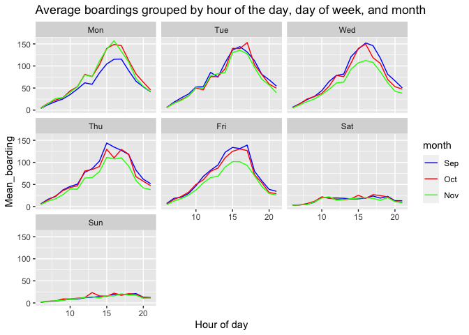
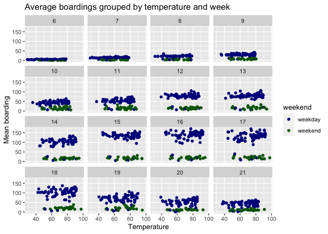
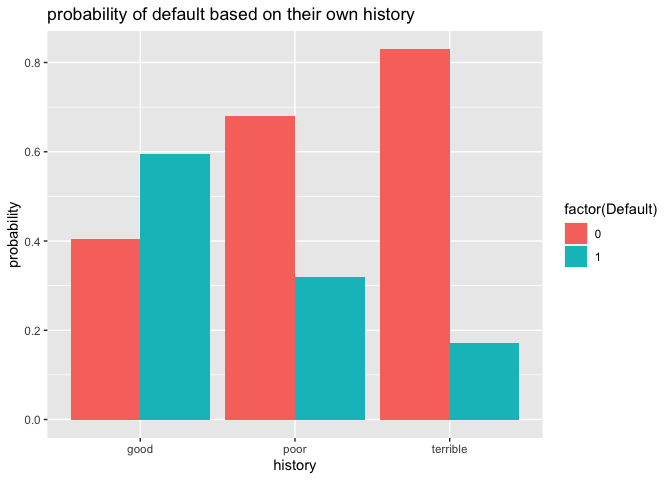
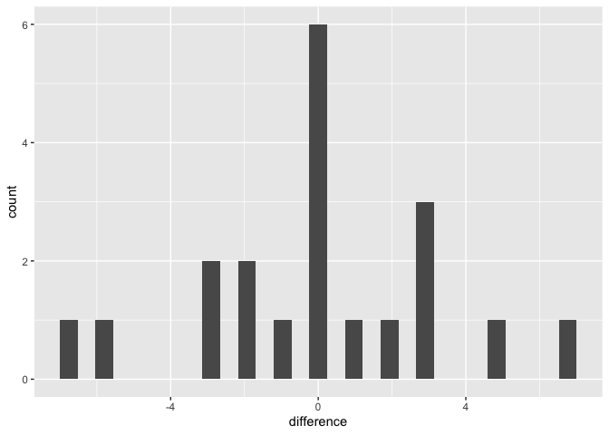

Author: LiZhao Du YiJi Gao Jyun-Yu Cheng

# Question 1

    ##             timestamp boarding alighting day_of_week temperature hour_of_day
    ## 1 2018-09-01 06:00:00        0         1         Sat       74.82           6
    ## 2 2018-09-01 06:15:00        2         1         Sat       74.82           6
    ## 3 2018-09-01 06:30:00        3         4         Sat       74.82           6
    ## 4 2018-09-01 06:45:00        3         4         Sat       74.82           6
    ## 5 2018-09-01 07:00:00        2         4         Sat       74.39           7
    ## 6 2018-09-01 07:15:00        4         4         Sat       74.39           7
    ##   month weekend
    ## 1   Sep weekend
    ## 2   Sep weekend
    ## 3   Sep weekend
    ## 4   Sep weekend
    ## 5   Sep weekend
    ## 6   Sep weekend

    ## # A tibble: 1,443 × 4
    ## # Groups:   temperature, hour_of_day [1,433]
    ##    temperature hour_of_day weekend mean_boarding
    ##          <dbl>       <int> <chr>           <dbl>
    ##  1        29.2           6 weekday          5   
    ##  2        29.3           7 weekday         12.5 
    ##  3        30.8           6 weekday          3.75
    ##  4        31.6           7 weekday         16.8 
    ##  5        31.6           8 weekday         21.5 
    ##  6        33.4           7 weekday         13.5 
    ##  7        33.7           6 weekday          4.75
    ##  8        34.8           7 weekday         14.2 
    ##  9        35.2           6 weekday          4.25
    ## 10        35.2           8 weekday         21.2 
    ## # … with 1,433 more rows

Problem1: (1)The hour of peak of boarding is almost the same from day to
day, its range is about from 4 p.m. to 5 p.m.

(2)The reason that average boarding on Mondays in September look lower,
compared to other days and months, is the summer break just finish, so
not all the students come back.

(3)The reason that average boarding on Weds/Thurs/Fri in November look
lower is because of the Thanksgiving holiday , which lower the the
average boarding of November.

Problem2: When we hold hour of day and weekend status constant,
temperature seems have not an noticeable effect on the number of UT
students riding the bus,the line is horizontal.

# Question 2

## build better model

we try three different models, and calculate the RMSE

model\_1 : lm(price ~ lotSize + lotSize:age + age + landValue +
bathrooms + sewer + centralAir, data=saratoga\_train)

model\_2 : lm(price ~ lotSize + age + log(landValue) + log(livingArea) +
bedrooms + bathrooms + bedrooms:bathrooms + rooms + centralAir,
data=saratoga\_train)

model\_3 : lm(price ~ lotSize + age + log(landValue) + log(livingArea)
log(landValue):log(livingArea) + bedrooms + bathrooms + rooms +
centralAir + fireplaces:waterfront, data = saratoga\_train)

and we can get their out of sample’s RMSE like:

    ## [1] 69937.36

    ## [1] 69022.39

    ## [1] 66875.13

so I think model\_3 is best model I can get from linear model

build the best K-nearest-neighbor regression model for price I also use
the same variables I used in model\_3

we can get the best k as:

    ## [1] 25

then We calculate the knn method RMSE

    ## [1] 0.3008194

then averaging the estimate of out-of-sample RMSE over many different
random train/test splits, either randomly or by cross-validation.

# Question 3 Classification and retrospective sampling

first we input dataset and make a bar plot of default probability by
credit history, Make a bar plot of default probability by credit history

then build a logistic regression model for predicting default
probability

    ## 
    ## Call:
    ## glm(formula = Default ~ duration + amount + installment + age + 
    ##     history + purpose + foreign, family = "binomial", data = german_credit)
    ## 
    ## Deviance Residuals: 
    ##     Min       1Q   Median       3Q      Max  
    ## -2.3464  -0.8050  -0.5751   1.0250   2.4767  
    ## 
    ## Coefficients:
    ##                       Estimate Std. Error z value Pr(>|z|)    
    ## (Intercept)         -7.075e-01  4.726e-01  -1.497  0.13435    
    ## duration             2.526e-02  8.100e-03   3.118  0.00182 ** 
    ## amount               9.596e-05  3.650e-05   2.629  0.00856 ** 
    ## installment          2.216e-01  7.626e-02   2.906  0.00366 ** 
    ## age                 -2.018e-02  7.224e-03  -2.794  0.00521 ** 
    ## historypoor         -1.108e+00  2.473e-01  -4.479 7.51e-06 ***
    ## historyterrible     -1.885e+00  2.822e-01  -6.679 2.41e-11 ***
    ## purposeedu           7.248e-01  3.707e-01   1.955  0.05058 .  
    ## purposegoods/repair  1.049e-01  2.573e-01   0.408  0.68346    
    ## purposenewcar        8.545e-01  2.773e-01   3.081  0.00206 ** 
    ## purposeusedcar      -7.959e-01  3.598e-01  -2.212  0.02694 *  
    ## foreigngerman       -1.265e+00  5.773e-01  -2.191  0.02849 *  
    ## ---
    ## Signif. codes:  0 '***' 0.001 '**' 0.01 '*' 0.05 '.' 0.1 ' ' 1
    ## 
    ## (Dispersion parameter for binomial family taken to be 1)
    ## 
    ##     Null deviance: 1221.7  on 999  degrees of freedom
    ## Residual deviance: 1070.0  on 988  degrees of freedom
    ## AIC: 1094
    ## 
    ## Number of Fisher Scoring iterations: 4

We can see the result that coefficent of history: poor and terible
history have a huge negative effect on Default.Check the statstical
significant for these variables, it shows they are statistical
significant

I don’t think this data set is appropiate for building a predictive
model, since bank sampled a set of loans that had defaulted for
inclusion in the study.

# Question 4

    ## [1] 0.2690609

    ## [1] 0.2321865

    ## [1] 0.2321464

    ## [1] 0.2690229

    ## [1] 0.2249675

    ## [1] 0.2248601

    ##    actual_num predict_num difference
    ## 1          18          21          3
    ## 2          20          21          1
    ## 3          12          15          3
    ## 4          17          17          0
    ## 5          23          21         -2
    ## 6          25          25          0
    ## 7          28          21         -7
    ## 8          17          17          0
    ## 9          24          18         -6
    ## 10         18          18          0
    ## 11         14          21          7
    ## 12         19          21          2
    ## 13         17          22          5
    ## 14         18          21          3
    ## 15         19          19          0
    ## 16         20          17         -3
    ## 17         24          22         -2
    ## 18         24          24          0
    ## 19         21          20         -1
    ## 20         24          21         -3

Not good. The prediction isn’t accurate. Both numbers always move in the
same direction, but the actual numbers wiggle more than predict number.
