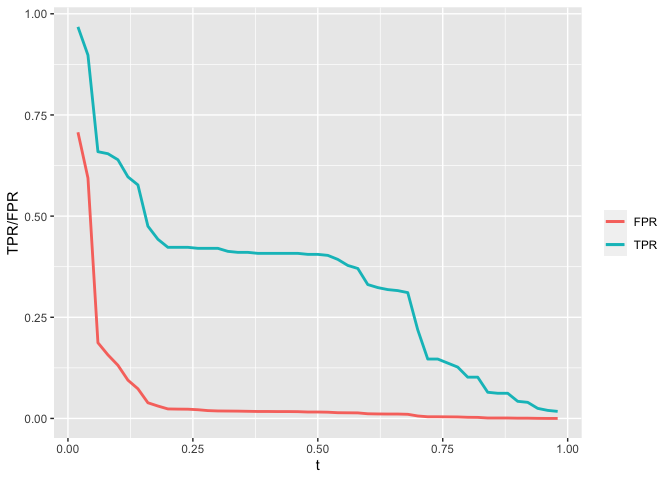

Author: LiZhao Du YiJi Gao Jyun-Yu Cheng

# Question 1

    ##             timestamp boarding alighting day_of_week temperature hour_of_day
    ## 1 2018-09-01 06:00:00        0         1         Sat       74.82           6
    ## 2 2018-09-01 06:15:00        2         1         Sat       74.82           6
    ## 3 2018-09-01 06:30:00        3         4         Sat       74.82           6
    ## 4 2018-09-01 06:45:00        3         4         Sat       74.82           6
    ## 5 2018-09-01 07:00:00        2         4         Sat       74.39           7
    ## 6 2018-09-01 07:15:00        4         4         Sat       74.39           7
    ##   month weekend
    ## 1   Sep weekend
    ## 2   Sep weekend
    ## 3   Sep weekend
    ## 4   Sep weekend
    ## 5   Sep weekend
    ## 6   Sep weekend

    ## # A tibble: 1,443 × 4
    ## # Groups:   temperature, hour_of_day [1,433]
    ##    temperature hour_of_day weekend mean_boarding
    ##          <dbl>       <int> <chr>           <dbl>
    ##  1        29.2           6 weekday          5   
    ##  2        29.3           7 weekday         12.5 
    ##  3        30.8           6 weekday          3.75
    ##  4        31.6           7 weekday         16.8 
    ##  5        31.6           8 weekday         21.5 
    ##  6        33.4           7 weekday         13.5 
    ##  7        33.7           6 weekday          4.75
    ##  8        34.8           7 weekday         14.2 
    ##  9        35.2           6 weekday          4.25
    ## 10        35.2           8 weekday         21.2 
    ## # … with 1,433 more rows

Problem1: (1)The hour of peak of boarding is almost the same from day to
day, its range is about from 4 p.m. to 5 p.m.

(2)The reason that average boarding on Mondays in September look lower,
compared to other days and months, is the summer break just finish, so
not all the students come back.

(3)The reason that average boarding on Weds/Thurs/Fri in November look
lower is because of the Thanksgiving holiday , which lower the the
average boarding of November.

Problem2: When we hold hour of day and weekend status constant,
temperature seems have not an noticeable effect on the number of UT
students riding the bus,the line is horizontal.

#Question 2

## build better model

we try three different models, and calculate the RMSE

model\_1 : lm(price ~ lotSize + lotSize:age + age + landValue +
bathrooms + sewer + centralAir, data=saratoga\_train)

model\_2 : lm(price ~ lotSize + age + log(landValue) + log(livingArea) +
bedrooms + bathrooms + bedrooms:bathrooms + rooms + centralAir,
data=saratoga\_train)

model\_3 : lm(price ~ lotSize + age + log(landValue) + log(livingArea)
log(landValue):log(livingArea) + bedrooms + bathrooms + rooms +
centralAir + fireplaces:waterfront, data = saratoga\_train)

and we can get their out of sample’s RMSE like:

    rmse(lm1, saratoga_test)

    ## [1] 69129.65

    rmse(lm2, saratoga_test)

    ## [1] 72200.48

    rmse(lm3, saratoga_test)  

    ## [1] 68642.28

so I think model\_3 is best model I can get from linear model

build the best K-nearest-neighbor regression model for price I also use
the same variables I used in model\_3

we can get the best k as:

    k_min_rmse

    ## [1] 25

then We calculate the knn method RMSE

    RMSE_knn

    ## [1] 0.3205668

then averaging the estimate of out-of-sample RMSE over many different
random train/test splits, either randomly or by cross-validation.

    library(parallel)
    rmse_sim = do(20)*{
      # fresh train/test split
      sara_split =  initial_split(SaratogaHouses, prop=0.8)
      sara_train = training(sara_split)
      sara_test  = testing(sara_split)
      
      # refit our models to this particular split
      # we're using "update" here to avoid having to type out the giant model formulas
    lm1 = update(lm1, data=sara_train)
    lm2 = update(lm2, data=sara_train)
    lm3 = update(lm3, data=sara_train)

    # collect the model errors in a single vector
    model_errors = c(rmse(lm1, sara_test), rmse(lm2, sara_test), rmse(lm3, sara_test))

    # return the model errors
    model_errors
    }

    ## Using parallel package.
    ##   * Set seed with set.rseed().
    ##   * Disable this message with options(`mosaic:parallelMessage` = FALSE)

# Question 3 Classification and retrospective sampling

first we input dataset and make a bar plot of default probability by
credit history, Make a bar plot of default probability by credit history

then build a logistic regression model for predicting default
probability

    summary(logit_history)

    ## 
    ## Call:
    ## glm(formula = Default ~ duration + amount + installment + age + 
    ##     history + purpose + foreign, family = "binomial", data = german_credit)
    ## 
    ## Deviance Residuals: 
    ##     Min       1Q   Median       3Q      Max  
    ## -2.3464  -0.8050  -0.5751   1.0250   2.4767  
    ## 
    ## Coefficients:
    ##                       Estimate Std. Error z value Pr(>|z|)    
    ## (Intercept)         -7.075e-01  4.726e-01  -1.497  0.13435    
    ## duration             2.526e-02  8.100e-03   3.118  0.00182 ** 
    ## amount               9.596e-05  3.650e-05   2.629  0.00856 ** 
    ## installment          2.216e-01  7.626e-02   2.906  0.00366 ** 
    ## age                 -2.018e-02  7.224e-03  -2.794  0.00521 ** 
    ## historypoor         -1.108e+00  2.473e-01  -4.479 7.51e-06 ***
    ## historyterrible     -1.885e+00  2.822e-01  -6.679 2.41e-11 ***
    ## purposeedu           7.248e-01  3.707e-01   1.955  0.05058 .  
    ## purposegoods/repair  1.049e-01  2.573e-01   0.408  0.68346    
    ## purposenewcar        8.545e-01  2.773e-01   3.081  0.00206 ** 
    ## purposeusedcar      -7.959e-01  3.598e-01  -2.212  0.02694 *  
    ## foreigngerman       -1.265e+00  5.773e-01  -2.191  0.02849 *  
    ## ---
    ## Signif. codes:  0 '***' 0.001 '**' 0.01 '*' 0.05 '.' 0.1 ' ' 1
    ## 
    ## (Dispersion parameter for binomial family taken to be 1)
    ## 
    ##     Null deviance: 1221.7  on 999  degrees of freedom
    ## Residual deviance: 1070.0  on 988  degrees of freedom
    ## AIC: 1094
    ## 
    ## Number of Fisher Scoring iterations: 4

We can see the result that coefficent of history: poor and terible
history have a huge negative effect on Default.Check the statstical
significant for these variables, it shows they are statistical
significant

I don’t think this data set is appropiate for building a predictive
model, since bank sampled a set of loans that had defaulted for
inclusion in the study.

# Question 4

    ##          hotel lead_time stays_in_weekend_nights stays_in_week_nights adults
    ## 1   City_Hotel       217                       1                    3      2
    ## 2   City_Hotel         2                       0                    1      2
    ## 3 Resort_Hotel        95                       2                    5      2
    ## 4 Resort_Hotel       143                       2                    6      2
    ## 5 Resort_Hotel       136                       1                    4      2
    ## 6   City_Hotel        67                       2                    2      2
    ##   children meal market_segment distribution_channel is_repeated_guest
    ## 1        0   BB  Offline_TA/TO                TA/TO                 0
    ## 2        0   BB         Direct               Direct                 0
    ## 3        0   BB      Online_TA                TA/TO                 0
    ## 4        0   HB      Online_TA                TA/TO                 0
    ## 5        0   HB         Direct               Direct                 0
    ## 6        0   SC      Online_TA                TA/TO                 0
    ##   previous_cancellations previous_bookings_not_canceled reserved_room_type
    ## 1                      0                              0                  A
    ## 2                      0                              0                  D
    ## 3                      0                              0                  A
    ## 4                      0                              0                  A
    ## 5                      0                              0                  F
    ## 6                      0                              0                  A
    ##   assigned_room_type booking_changes deposit_type days_in_waiting_list
    ## 1                  A               0   No_Deposit                    0
    ## 2                  K               0   No_Deposit                    0
    ## 3                  A               2   No_Deposit                    0
    ## 4                  A               0   No_Deposit                    0
    ## 5                  F               0   No_Deposit                    0
    ## 6                  A               0   No_Deposit                    0
    ##     customer_type average_daily_rate required_car_parking_spaces
    ## 1 Transient-Party              80.75                        none
    ## 2       Transient             170.00                        none
    ## 3       Transient               8.00                        none
    ## 4       Transient              81.00                        none
    ## 5       Transient             157.60                        none
    ## 6       Transient              49.09                        none
    ##   total_of_special_requests arrival_date
    ## 1                         1   2016-09-01
    ## 2                         3   2017-08-25
    ## 3                         2   2016-11-19
    ## 4                         1   2016-04-26
    ## 5                         4   2016-12-28
    ## 6                         1   2016-03-13

    ##          hotel lead_time stays_in_weekend_nights stays_in_week_nights adults
    ## 1 Resort_Hotel        47                       0                    2      2
    ## 2 Resort_Hotel        46                       0                    2      2
    ## 3   City_Hotel        22                       1                    2      2
    ## 4 Resort_Hotel       209                       2                    5      2
    ## 5   City_Hotel         1                       1                    0      2
    ## 6 Resort_Hotel       171                       2                    5      2
    ##   children meal market_segment distribution_channel is_repeated_guest
    ## 1        1   BB         Direct               Direct                 0
    ## 2        0   BB  Offline_TA/TO                TA/TO                 0
    ## 3        0   BB      Online_TA                TA/TO                 0
    ## 4        0   BB  Offline_TA/TO                TA/TO                 0
    ## 5        0   SC      Online_TA                TA/TO                 0
    ## 6        0   BB      Online_TA                TA/TO                 0
    ##   previous_cancellations previous_bookings_not_canceled reserved_room_type
    ## 1                      0                              0                  C
    ## 2                      0                              0                  D
    ## 3                      0                              0                  D
    ## 4                      0                              0                  A
    ## 5                      0                              0                  A
    ## 6                      0                              0                  D
    ##   assigned_room_type booking_changes deposit_type days_in_waiting_list
    ## 1                  C               0   No_Deposit                    0
    ## 2                  D               0   No_Deposit                    0
    ## 3                  D               0   No_Deposit                    0
    ## 4                  A               0   No_Deposit                    0
    ## 5                  B               0   No_Deposit                    0
    ## 6                  D               2   No_Deposit                    0
    ##     customer_type average_daily_rate required_car_parking_spaces
    ## 1       Transient             289.00                        none
    ## 2       Transient             162.00                        none
    ## 3       Transient             121.33                        none
    ## 4       Transient              76.22                        none
    ## 5       Transient              98.00                        none
    ## 6 Transient-Party             182.86                        none
    ##   total_of_special_requests arrival_date
    ## 1                         1   2017-08-23
    ## 2                         0   2016-12-30
    ## 3                         0   2017-03-13
    ## 4                         0   2016-07-12
    ## 5                         0   2016-08-07
    ## 6                         1   2017-07-25

    ## Start:  AIC=13323.92
    ## children ~ market_segment + adults + customer_type + is_repeated_guest + 
    ##     reserved_room_type + assigned_room_type
    ## 
    ##                                         Df Deviance     AIC
    ## + market_segment:reserved_room_type     33    12867   12989
    ## + adults:reserved_room_type              7    12988   13058
    ## + market_segment:assigned_room_type     49    12992   13146
    ## + adults:assigned_room_type              9    13122   13196
    ## + market_segment:adults                  6    13198   13266
    ## + market_segment:customer_type          16    13192   13280
    ## + customer_type:reserved_room_type      20    13196   13292
    ## + customer_type:assigned_room_type      26    13198   13306
    ## + adults:is_repeated_guest               1    13258   13316
    ## + is_repeated_guest:reserved_room_type   7    13254   13324
    ## <none>                                        13268   13324
    ## + market_segment:is_repeated_guest       6    13256   13324
    ## + is_repeated_guest:assigned_room_type   9    13252   13326
    ## + adults:customer_type                   3    13264   13326
    ## + customer_type:is_repeated_guest        3    13265   13327
    ## - adults                                 1    13282   13336
    ## - customer_type                          3    13313   13363
    ## - is_repeated_guest                      1    13326   13380
    ## - assigned_room_type                     9    13467   13505
    ## - market_segment                         6    13545   13589
    ## - reserved_room_type                     7    14018   14060
    ## + reserved_room_type:assigned_room_type 48  1183524 1183676
    ## 
    ## Step:  AIC=12989.2
    ## children ~ market_segment + adults + customer_type + is_repeated_guest + 
    ##     reserved_room_type + assigned_room_type + market_segment:reserved_room_type
    ## 
    ##                                         Df Deviance   AIC
    ## + adults:reserved_room_type              7    12594 12730
    ## + adults:assigned_room_type              9    12718 12858
    ## + market_segment:adults                  6    12791 12925
    ## + market_segment:customer_type          16    12796 12950
    ## + customer_type:reserved_room_type      20    12811 12973
    ## + adults:is_repeated_guest               1    12858 12982
    ## + is_repeated_guest:reserved_room_type   7    12848 12984
    ## + customer_type:assigned_room_type      26    12810 12984
    ## + is_repeated_guest:assigned_room_type   9    12846 12986
    ## <none>                                        12867 12989
    ## + market_segment:is_repeated_guest       6    12856 12990
    ## + adults:customer_type                   3    12862 12990
    ## + customer_type:is_repeated_guest        3    12864 12992
    ## - adults                                 1    12879 12999
    ## - customer_type                          3    12913 13029
    ## + market_segment:assigned_room_type     49    12810 13030
    ## - is_repeated_guest                      1    12917 13037
    ## - assigned_room_type                     9    13064 13168
    ## - market_segment:reserved_room_type     33    13268 13324
    ## + reserved_room_type:assigned_room_type 48    16026 16244
    ## 
    ## Step:  AIC=12730.22
    ## children ~ market_segment + adults + customer_type + is_repeated_guest + 
    ##     reserved_room_type + assigned_room_type + market_segment:reserved_room_type + 
    ##     adults:reserved_room_type
    ## 
    ##                                         Df Deviance     AIC
    ## + market_segment:adults                  6    12538   12686
    ## + market_segment:customer_type          16    12536   12704
    ## + is_repeated_guest:reserved_room_type   7    12569   12719
    ## + adults:assigned_room_type              9    12567   12721
    ## + customer_type:assigned_room_type      26    12534   12722
    ## + is_repeated_guest:assigned_room_type   9    12570   12724
    ## + adults:is_repeated_guest               1    12588   12726
    ## + customer_type:reserved_room_type      20    12551   12727
    ## + market_segment:is_repeated_guest       6    12581   12729
    ## <none>                                        12594   12730
    ## + customer_type:is_repeated_guest        3    12591   12733
    ## + adults:customer_type                   3    12592   12734
    ## - is_repeated_guest                      1    12634   12768
    ## - customer_type                          3    12638   12768
    ## + market_segment:assigned_room_type     49    12539   12773
    ## - assigned_room_type                     9    12786   12904
    ## - adults:reserved_room_type              7    12867   12989
    ## - market_segment:reserved_room_type     33    12988   13058
    ## + reserved_room_type:assigned_room_type 47  1468130 1468360
    ## 
    ## Step:  AIC=12686.35
    ## children ~ market_segment + adults + customer_type + is_repeated_guest + 
    ##     reserved_room_type + assigned_room_type + market_segment:reserved_room_type + 
    ##     adults:reserved_room_type + market_segment:adults
    ## 
    ##                                         Df Deviance   AIC
    ## + market_segment:customer_type          16    12482 12662
    ## + reserved_room_type:assigned_room_type 48    12423 12667
    ## + adults:assigned_room_type              9    12513 12679
    ## + is_repeated_guest:reserved_room_type   7    12518 12680
    ## + customer_type:assigned_room_type      26    12481 12681
    ## + is_repeated_guest:assigned_room_type   9    12516 12682
    ## + customer_type:reserved_room_type      20    12495 12683
    ## + adults:is_repeated_guest               1    12536 12686
    ## <none>                                        12538 12686
    ## + market_segment:is_repeated_guest       6    12528 12688
    ## + customer_type:is_repeated_guest        3    12535 12689
    ## + adults:customer_type                   3    12537 12691
    ## - is_repeated_guest                      1    12574 12720
    ## - customer_type                          3    12585 12727
    ## + market_segment:assigned_room_type     49    12484 12730
    ## - market_segment:adults                  6    12594 12730
    ## - assigned_room_type                     9    12728 12858
    ## - adults:reserved_room_type              7    12791 12925
    ## - market_segment:reserved_room_type     33    12941 13023
    ## 
    ## Step:  AIC=12661.7
    ## children ~ market_segment + adults + customer_type + is_repeated_guest + 
    ##     reserved_room_type + assigned_room_type + market_segment:reserved_room_type + 
    ##     adults:reserved_room_type + market_segment:adults + market_segment:customer_type
    ## 
    ##                                         Df Deviance   AIC
    ## + reserved_room_type:assigned_room_type 48    12366 12642
    ## + customer_type:reserved_room_type      20    12436 12656
    ## + adults:assigned_room_type              9    12458 12656
    ## + is_repeated_guest:reserved_room_type   7    12462 12656
    ## + is_repeated_guest:assigned_room_type   9    12460 12658
    ## + adults:is_repeated_guest               1    12480 12662
    ## <none>                                        12482 12662
    ## + market_segment:is_repeated_guest       6    12470 12662
    ## + customer_type:assigned_room_type      26    12432 12664
    ## + customer_type:is_repeated_guest        3    12480 12666
    ## + adults:customer_type                   3    12481 12667
    ## - market_segment:customer_type          16    12538 12686
    ## - is_repeated_guest                      1    12518 12696
    ## - market_segment:adults                  6    12536 12704
    ## + market_segment:assigned_room_type     49    12426 12704
    ## - assigned_room_type                     9    12667 12829
    ## - adults:reserved_room_type              7    12727 12893
    ## - market_segment:reserved_room_type     33    12881 12995
    ## 
    ## Step:  AIC=12641.77
    ## children ~ market_segment + adults + customer_type + is_repeated_guest + 
    ##     reserved_room_type + assigned_room_type + market_segment:reserved_room_type + 
    ##     adults:reserved_room_type + market_segment:adults + market_segment:customer_type + 
    ##     reserved_room_type:assigned_room_type
    ## 
    ##                                         Df Deviance    AIC
    ## + is_repeated_guest:assigned_room_type   9    12342  12636
    ## + adults:is_repeated_guest               1    12363  12641
    ## <none>                                        12366  12642
    ## + adults:assigned_room_type              9    12348  12642
    ## + customer_type:is_repeated_guest        3    12364  12646
    ## + customer_type:assigned_room_type      26    12324  12652
    ## - reserved_room_type:assigned_room_type 48    12482  12662
    ## - market_segment:customer_type          16    12423  12667
    ## + adults:customer_type                   3    12437  12719
    ## - market_segment:reserved_room_type     33    12770  12980
    ## + market_segment:is_repeated_guest       6    13291  13579
    ## - adults:reserved_room_type              7    18609  18871
    ## + customer_type:reserved_room_type      19   140931 141245
    ## - is_repeated_guest                      2   147707 147979
    ## + is_repeated_guest:reserved_room_type   6   151383 151671
    ## + market_segment:assigned_room_type     48   161187 161559
    ## - market_segment:adults                  6   267228 267492
    ## 
    ## Step:  AIC=12636.1
    ## children ~ market_segment + adults + customer_type + is_repeated_guest + 
    ##     reserved_room_type + assigned_room_type + market_segment:reserved_room_type + 
    ##     adults:reserved_room_type + market_segment:adults + market_segment:customer_type + 
    ##     reserved_room_type:assigned_room_type + is_repeated_guest:assigned_room_type
    ## 
    ##                                         Df Deviance     AIC
    ## + customer_type:reserved_room_type      20    12298   12632
    ## + adults:is_repeated_guest               1    12339   12635
    ## <none>                                        12342   12636
    ## + is_repeated_guest:reserved_room_type   7    12330   12638
    ## + market_segment:is_repeated_guest       6    12332   12638
    ## + customer_type:is_repeated_guest        3    12339   12639
    ## - is_repeated_guest:assigned_room_type   9    12366   12642
    ## - reserved_room_type:assigned_room_type 48    12460   12658
    ## + market_segment:assigned_room_type     49    12278   12670
    ## - market_segment:adults                  6    12394   12676
    ## - market_segment:reserved_room_type     33    12749   12977
    ## - market_segment:customer_type          16    13885   14147
    ## + adults:customer_type                   2   149149  149447
    ## + customer_type:assigned_room_type      28  1457822 1458172
    ## - adults:reserved_room_type              7  1575396 1575676
    ## + adults:assigned_room_type              8  1685978 1686288
    ## 
    ## Step:  AIC=12631.78
    ## children ~ market_segment + adults + customer_type + is_repeated_guest + 
    ##     reserved_room_type + assigned_room_type + market_segment:reserved_room_type + 
    ##     adults:reserved_room_type + market_segment:adults + market_segment:customer_type + 
    ##     reserved_room_type:assigned_room_type + is_repeated_guest:assigned_room_type + 
    ##     customer_type:reserved_room_type
    ## 
    ##                                         Df Deviance     AIC
    ## <none>                                        12298   12632
    ## + customer_type:is_repeated_guest        3    12293   12633
    ## + adults:customer_type                   3    12295   12635
    ## - customer_type:reserved_room_type      20    12342   12636
    ## - reserved_room_type:assigned_room_type 48    12415   12653
    ## - market_segment:adults                  6    12348   12670
    ## - adults:reserved_room_type              7    12554   12874
    ## - market_segment:reserved_room_type     33    12686   12954
    ## - is_repeated_guest:assigned_room_type  10   140931  141245
    ## + is_repeated_guest:reserved_room_type   6   158376  158722
    ## + adults:is_repeated_guest               5   187139  187483
    ## + market_segment:assigned_room_type     51   840754  841190
    ## + adults:assigned_room_type              9  1142367 1142719
    ## - market_segment:customer_type          16  1454927 1455229
    ## + customer_type:assigned_room_type      24  1460396 1460778
    ## + market_segment:is_repeated_guest       6  1558167 1558513

    ## glm(formula = children ~ market_segment + adults + customer_type + 
    ##     is_repeated_guest + reserved_room_type + assigned_room_type + 
    ##     market_segment:reserved_room_type + adults:reserved_room_type + 
    ##     market_segment:adults + market_segment:customer_type + reserved_room_type:assigned_room_type + 
    ##     is_repeated_guest:assigned_room_type + customer_type:reserved_room_type, 
    ##     family = "binomial", data = hotels_dev_train)

    ##                                              (Intercept) 
    ##                                            -2.465255e+01 
    ##                              market_segmentComplementary 
    ##                                            -5.337551e+00 
    ##                                  market_segmentCorporate 
    ##                                            -8.711005e+00 
    ##                                     market_segmentDirect 
    ##                                            -3.241894e+00 
    ##                                     market_segmentGroups 
    ##                                            -3.689770e+00 
    ##                              market_segmentOffline_TA/TO 
    ##                                             2.085517e+01 
    ##                                  market_segmentOnline_TA 
    ##                                             2.046074e+01 
    ##                                                   adults 
    ##                                             1.709711e-01 
    ##                                       customer_typeGroup 
    ##                                             2.948826e-01 
    ##                                   customer_typeTransient 
    ##                                             3.208805e+00 
    ##                             customer_typeTransient-Party 
    ##                                             7.211969e-01 
    ##                                        is_repeated_guest 
    ##                                            -6.480950e-01 
    ##                                      reserved_room_typeB 
    ##                                             6.791848e+00 
    ##                                      reserved_room_typeC 
    ##                                            -4.154569e+01 
    ##                                      reserved_room_typeD 
    ##                                            -4.231645e+00 
    ##                                      reserved_room_typeE 
    ##                                            -4.761328e+00 
    ##                                      reserved_room_typeF 
    ##                                             8.551813e+00 
    ##                                      reserved_room_typeG 
    ##                                             5.076616e+00 
    ##                                      reserved_room_typeH 
    ##                                             4.216123e+11 
    ##                                      assigned_room_typeB 
    ##                                             8.775319e-01 
    ##                                      assigned_room_typeC 
    ##                                             1.094264e+00 
    ##                                      assigned_room_typeD 
    ##                                             1.057369e+00 
    ##                                      assigned_room_typeE 
    ##                                             8.385757e-01 
    ##                                      assigned_room_typeF 
    ##                                             6.151115e-01 
    ##                                      assigned_room_typeG 
    ##                                             8.737416e-01 
    ##                                      assigned_room_typeH 
    ##                                             2.674541e-01 
    ##                                      assigned_room_typeI 
    ##                                             1.002934e-02 
    ##                                      assigned_room_typeK 
    ##                                            -7.549234e-01 
    ##          market_segmentComplementary:reserved_room_typeB 
    ##                                             1.697359e+00 
    ##              market_segmentCorporate:reserved_room_typeB 
    ##                                             5.602834e+01 
    ##                 market_segmentDirect:reserved_room_typeB 
    ##                                             2.454567e-01 
    ##                 market_segmentGroups:reserved_room_typeB 
    ##                                            -2.138555e+01 
    ##          market_segmentOffline_TA/TO:reserved_room_typeB 
    ##                                             4.423972e-01 
    ##              market_segmentOnline_TA:reserved_room_typeB 
    ##                                                       NA 
    ##          market_segmentComplementary:reserved_room_typeC 
    ##                                            -2.492484e+01 
    ##              market_segmentCorporate:reserved_room_typeC 
    ##                                             2.862538e+01 
    ##                 market_segmentDirect:reserved_room_typeC 
    ##                                             3.329572e-01 
    ##                 market_segmentGroups:reserved_room_typeC 
    ##                                             2.385664e+00 
    ##          market_segmentOffline_TA/TO:reserved_room_typeC 
    ##                                             2.811615e-01 
    ##              market_segmentOnline_TA:reserved_room_typeC 
    ##                                                       NA 
    ##          market_segmentComplementary:reserved_room_typeD 
    ##                                             6.194485e+00 
    ##              market_segmentCorporate:reserved_room_typeD 
    ##                                             5.916076e+00 
    ##                 market_segmentDirect:reserved_room_typeD 
    ##                                             5.709462e+00 
    ##                 market_segmentGroups:reserved_room_typeD 
    ##                                             5.398871e+00 
    ##          market_segmentOffline_TA/TO:reserved_room_typeD 
    ##                                             5.493859e+00 
    ##              market_segmentOnline_TA:reserved_room_typeD 
    ##                                             4.728323e+00 
    ##          market_segmentComplementary:reserved_room_typeE 
    ##                                             6.424018e+00 
    ##              market_segmentCorporate:reserved_room_typeE 
    ##                                            -1.670462e+01 
    ##                 market_segmentDirect:reserved_room_typeE 
    ##                                             5.567183e+00 
    ##                 market_segmentGroups:reserved_room_typeE 
    ##                                            -3.709874e+01 
    ##          market_segmentOffline_TA/TO:reserved_room_typeE 
    ##                                             4.946405e+00 
    ##              market_segmentOnline_TA:reserved_room_typeE 
    ##                                             3.925077e+00 
    ##          market_segmentComplementary:reserved_room_typeF 
    ##                                            -8.579680e-01 
    ##              market_segmentCorporate:reserved_room_typeF 
    ##                                             1.013816e-01 
    ##                 market_segmentDirect:reserved_room_typeF 
    ##                                            -2.276012e+00 
    ##                 market_segmentGroups:reserved_room_typeF 
    ##                                            -2.494167e+01 
    ##          market_segmentOffline_TA/TO:reserved_room_typeF 
    ##                                            -1.003176e+00 
    ##              market_segmentOnline_TA:reserved_room_typeF 
    ##                                                       NA 
    ##          market_segmentComplementary:reserved_room_typeG 
    ##                                            -1.824604e+00 
    ##              market_segmentCorporate:reserved_room_typeG 
    ##                                            -2.551599e+01 
    ##                 market_segmentDirect:reserved_room_typeG 
    ##                                            -4.248941e-01 
    ##                 market_segmentGroups:reserved_room_typeG 
    ##                                            -8.849438e-01 
    ##          market_segmentOffline_TA/TO:reserved_room_typeG 
    ##                                            -9.585157e-01 
    ##              market_segmentOnline_TA:reserved_room_typeG 
    ##                                                       NA 
    ##          market_segmentComplementary:reserved_room_typeH 
    ##                                                       NA 
    ##              market_segmentCorporate:reserved_room_typeH 
    ##                                                       NA 
    ##                 market_segmentDirect:reserved_room_typeH 
    ##                                            -2.408371e+00 
    ##                 market_segmentGroups:reserved_room_typeH 
    ##                                                       NA 
    ##          market_segmentOffline_TA/TO:reserved_room_typeH 
    ##                                                       NA 
    ##              market_segmentOnline_TA:reserved_room_typeH 
    ##                                                       NA 
    ##                               adults:reserved_room_typeB 
    ##                                            -3.374201e+00 
    ##                               adults:reserved_room_typeC 
    ##                                            -2.556984e+00 
    ##                               adults:reserved_room_typeD 
    ##                                            -1.129756e+00 
    ##                               adults:reserved_room_typeE 
    ##                                             5.100730e-02 
    ##                               adults:reserved_room_typeF 
    ##                                            -9.509710e-01 
    ##                               adults:reserved_room_typeG 
    ##                                            -9.974548e-01 
    ##                               adults:reserved_room_typeH 
    ##                                            -6.046188e-01 
    ##                       market_segmentComplementary:adults 
    ##                                             1.919970e+00 
    ##                           market_segmentCorporate:adults 
    ##                                             2.415577e+00 
    ##                              market_segmentDirect:adults 
    ##                                             6.443573e-01 
    ##                              market_segmentGroups:adults 
    ##                                             7.260526e-01 
    ##                       market_segmentOffline_TA/TO:adults 
    ##                                             2.062241e-01 
    ##                           market_segmentOnline_TA:adults 
    ##                                             3.329508e-02 
    ##           market_segmentComplementary:customer_typeGroup 
    ##                                             1.553455e+00 
    ##               market_segmentCorporate:customer_typeGroup 
    ##                                             3.897618e+00 
    ##                  market_segmentDirect:customer_typeGroup 
    ##                                            -2.029259e+01 
    ##                  market_segmentGroups:customer_typeGroup 
    ##                                            -8.168304e-01 
    ##           market_segmentOffline_TA/TO:customer_typeGroup 
    ##                                            -5.318158e-01 
    ##               market_segmentOnline_TA:customer_typeGroup 
    ##                                                       NA 
    ##       market_segmentComplementary:customer_typeTransient 
    ##                                             1.919537e+01 
    ##           market_segmentCorporate:customer_typeTransient 
    ##                                             2.127233e+01 
    ##              market_segmentDirect:customer_typeTransient 
    ##                                             2.019575e+01 
    ##              market_segmentGroups:customer_typeTransient 
    ##                                            -3.330738e+00 
    ##       market_segmentOffline_TA/TO:customer_typeTransient 
    ##                                            -3.556226e+00 
    ##           market_segmentOnline_TA:customer_typeTransient 
    ##                                            -2.210247e+00 
    ## market_segmentComplementary:customer_typeTransient-Party 
    ##                                             2.235365e+01 
    ##     market_segmentCorporate:customer_typeTransient-Party 
    ##                                             2.273987e+01 
    ##        market_segmentDirect:customer_typeTransient-Party 
    ##                                             2.225126e+01 
    ##        market_segmentGroups:customer_typeTransient-Party 
    ##                                             2.051922e+01 
    ## market_segmentOffline_TA/TO:customer_typeTransient-Party 
    ##                                            -2.746503e+00 
    ##     market_segmentOnline_TA:customer_typeTransient-Party 
    ##                                                       NA 
    ##                  reserved_room_typeB:assigned_room_typeB 
    ##                                            -8.832469e-01 
    ##                  reserved_room_typeC:assigned_room_typeB 
    ##                                            -1.552478e+00 
    ##                  reserved_room_typeD:assigned_room_typeB 
    ##                                             1.930443e-01 
    ##                  reserved_room_typeE:assigned_room_typeB 
    ##                                             2.785954e+01 
    ##                  reserved_room_typeF:assigned_room_typeB 
    ##                                            -2.103496e+00 
    ##                  reserved_room_typeG:assigned_room_typeB 
    ##                                                       NA 
    ##                  reserved_room_typeH:assigned_room_typeB 
    ##                                                       NA 
    ##                  reserved_room_typeB:assigned_room_typeC 
    ##                                                       NA 
    ##                  reserved_room_typeC:assigned_room_typeC 
    ##                                             2.574458e+01 
    ##                  reserved_room_typeD:assigned_room_typeC 
    ##                                             1.238518e+00 
    ##                  reserved_room_typeE:assigned_room_typeC 
    ##                                             2.227633e+01 
    ##                  reserved_room_typeF:assigned_room_typeC 
    ##                                                       NA 
    ##                  reserved_room_typeG:assigned_room_typeC 
    ##                                             6.349847e-01 
    ##                  reserved_room_typeH:assigned_room_typeC 
    ##                                                       NA 
    ##                  reserved_room_typeB:assigned_room_typeD 
    ##                                             2.342693e+01 
    ##                  reserved_room_typeC:assigned_room_typeD 
    ##                                             2.387805e+01 
    ##                  reserved_room_typeD:assigned_room_typeD 
    ##                                            -8.745334e-01 
    ##                  reserved_room_typeE:assigned_room_typeD 
    ##                                            -2.069980e+00 
    ##                  reserved_room_typeF:assigned_room_typeD 
    ##                                                       NA 
    ##                  reserved_room_typeG:assigned_room_typeD 
    ##                                                       NA 
    ##                  reserved_room_typeH:assigned_room_typeD 
    ##                                            -4.216123e+11 
    ##                  reserved_room_typeB:assigned_room_typeE 
    ##                                             1.523313e+00 
    ##                  reserved_room_typeC:assigned_room_typeE 
    ##                                             5.259879e+01 
    ##                  reserved_room_typeD:assigned_room_typeE 
    ##                                            -4.714587e-01 
    ##                  reserved_room_typeE:assigned_room_typeE 
    ##                                            -2.113528e+00 
    ##                  reserved_room_typeF:assigned_room_typeE 
    ##                                            -2.802695e+01 
    ##                  reserved_room_typeG:assigned_room_typeE 
    ##                                             2.840025e+01 
    ##                  reserved_room_typeH:assigned_room_typeE 
    ##                                                       NA 
    ##                  reserved_room_typeB:assigned_room_typeF 
    ##                                             2.763743e+01 
    ##                  reserved_room_typeC:assigned_room_typeF 
    ##                                                       NA 
    ##                  reserved_room_typeD:assigned_room_typeF 
    ##                                            -2.655545e-01 
    ##                  reserved_room_typeE:assigned_room_typeF 
    ##                                            -2.261077e+00 
    ##                  reserved_room_typeF:assigned_room_typeF 
    ##                                            -9.305943e-01 
    ##                  reserved_room_typeG:assigned_room_typeF 
    ##                                             2.601294e+01 
    ##                  reserved_room_typeH:assigned_room_typeF 
    ##                                                       NA 
    ##                  reserved_room_typeB:assigned_room_typeG 
    ##                                             3.112970e+00 
    ##                  reserved_room_typeC:assigned_room_typeG 
    ##                                             7.301321e+01 
    ##                  reserved_room_typeD:assigned_room_typeG 
    ##                                             3.388923e-01 
    ##                  reserved_room_typeE:assigned_room_typeG 
    ##                                            -2.625488e+01 
    ##                  reserved_room_typeF:assigned_room_typeG 
    ##                                            -9.221457e-01 
    ##                  reserved_room_typeG:assigned_room_typeG 
    ##                                             2.646505e+01 
    ##                  reserved_room_typeH:assigned_room_typeG 
    ##                                            -4.216123e+11 
    ##                  reserved_room_typeB:assigned_room_typeH 
    ##                                                       NA 
    ##                  reserved_room_typeC:assigned_room_typeH 
    ##                                             2.654691e+01 
    ##                  reserved_room_typeD:assigned_room_typeH 
    ##                                             1.660340e+00 
    ##                  reserved_room_typeE:assigned_room_typeH 
    ##                                            -2.755177e+01 
    ##                  reserved_room_typeF:assigned_room_typeH 
    ##                                                       NA 
    ##                  reserved_room_typeG:assigned_room_typeH 
    ##                                             2.567384e+01 
    ##                  reserved_room_typeH:assigned_room_typeH 
    ##                                            -4.216123e+11 
    ##                  reserved_room_typeB:assigned_room_typeI 
    ##                                                       NA 
    ##                  reserved_room_typeC:assigned_room_typeI 
    ##                                             5.191777e+01 
    ##                  reserved_room_typeD:assigned_room_typeI 
    ##                                             3.582106e-01 
    ##                  reserved_room_typeE:assigned_room_typeI 
    ##                                            -2.556264e+01 
    ##                  reserved_room_typeF:assigned_room_typeI 
    ##                                            -2.561340e+01 
    ##                  reserved_room_typeG:assigned_room_typeI 
    ##                                             2.643602e+01 
    ##                  reserved_room_typeH:assigned_room_typeI 
    ##                                            -4.216123e+11 
    ##                  reserved_room_typeB:assigned_room_typeK 
    ##                                            -2.685571e+01 
    ##                  reserved_room_typeC:assigned_room_typeK 
    ##                                                       NA 
    ##                  reserved_room_typeD:assigned_room_typeK 
    ##                                             4.766204e-01 
    ##                  reserved_room_typeE:assigned_room_typeK 
    ##                                            -2.496442e+01 
    ##                  reserved_room_typeF:assigned_room_typeK 
    ##                                            -2.629580e+01 
    ##                  reserved_room_typeG:assigned_room_typeK 
    ##                                             5.430982e+01 
    ##                  reserved_room_typeH:assigned_room_typeK 
    ##                                                       NA 
    ##                    is_repeated_guest:assigned_room_typeB 
    ##                                             1.125917e+00 
    ##                    is_repeated_guest:assigned_room_typeC 
    ##                                            -9.377446e-01 
    ##                    is_repeated_guest:assigned_room_typeD 
    ##                                            -1.910519e+00 
    ##                    is_repeated_guest:assigned_room_typeE 
    ##                                            -1.779874e+00 
    ##                    is_repeated_guest:assigned_room_typeF 
    ##                                             5.710445e-01 
    ##                    is_repeated_guest:assigned_room_typeG 
    ##                                            -5.781166e-01 
    ##                    is_repeated_guest:assigned_room_typeH 
    ##                                             4.595337e-02 
    ##                    is_repeated_guest:assigned_room_typeI 
    ##                                             1.078829e+00 
    ##                    is_repeated_guest:assigned_room_typeK 
    ##                                             2.120344e+00 
    ##                   customer_typeGroup:reserved_room_typeB 
    ##                                             2.846561e-01 
    ##               customer_typeTransient:reserved_room_typeB 
    ##                                             5.559197e-01 
    ##         customer_typeTransient-Party:reserved_room_typeB 
    ##                                             2.921808e-01 
    ##                   customer_typeGroup:reserved_room_typeC 
    ##                                             4.074099e+01 
    ##               customer_typeTransient:reserved_room_typeC 
    ##                                             2.395846e+01 
    ##         customer_typeTransient-Party:reserved_room_typeC 
    ##                                             2.332171e+01 
    ##                   customer_typeGroup:reserved_room_typeD 
    ##                                             1.332651e+00 
    ##               customer_typeTransient:reserved_room_typeD 
    ##                                             1.376269e+00 
    ##         customer_typeTransient-Party:reserved_room_typeD 
    ##                                             1.513072e+00 
    ##                   customer_typeGroup:reserved_room_typeE 
    ##                                            -1.936962e+01 
    ##               customer_typeTransient:reserved_room_typeE 
    ##                                             1.815662e+00 
    ##         customer_typeTransient-Party:reserved_room_typeE 
    ##                                             2.620912e+00 
    ##                   customer_typeGroup:reserved_room_typeF 
    ##                                             1.936814e+01 
    ##               customer_typeTransient:reserved_room_typeF 
    ##                                            -2.724575e+00 
    ##         customer_typeTransient-Party:reserved_room_typeF 
    ##                                            -2.561453e+00 
    ##                   customer_typeGroup:reserved_room_typeG 
    ##                                            -1.036900e+01 
    ##               customer_typeTransient:reserved_room_typeG 
    ##                                            -2.676248e+01 
    ##         customer_typeTransient-Party:reserved_room_typeG 
    ##                                            -2.611069e+01 
    ##                   customer_typeGroup:reserved_room_typeH 
    ##                                             2.511155e+01 
    ##               customer_typeTransient:reserved_room_typeH 
    ##                                             4.802536e-01 
    ##         customer_typeTransient-Party:reserved_room_typeH 
    ##                                                       NA

    ## [1] 3.140773

    ## [1] 3.952815

    ## [1] 5.938494

My model didn’t perform well. In the new dataset, rmse of new set is
smaller than rmse of split set, but still close. The rmse of baseline1
is still the lowest.

# Model validation: step 1

Not good. The prediction isn’t accurate. Both numbers always move in the
same direction, but the actual numbers wiggle more than predict number.
