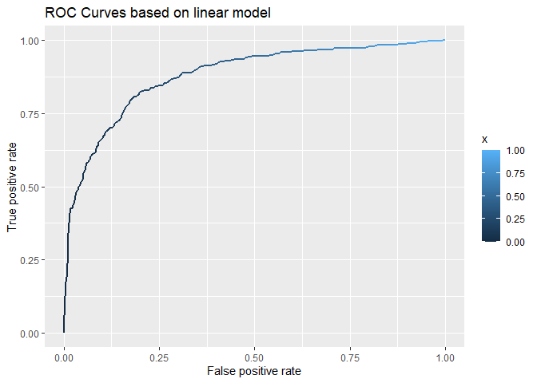
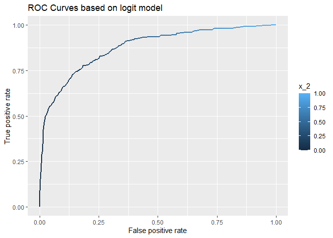
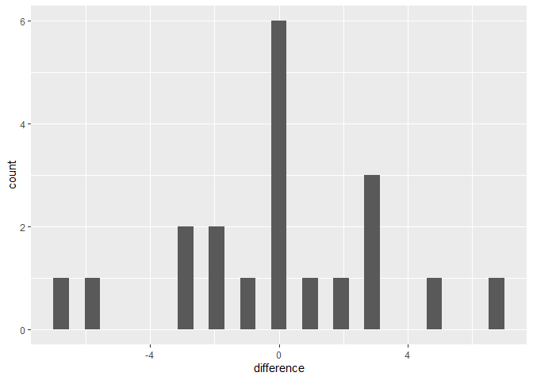

Author:

Jyun\_Yu\_Cheng

Li\_Zhao\_Du

Yi\_Ji\_Gao

### Question 1:

plot\_1:
--------

One panel of line graphs that plots average boardings grouped by hour of
the day, day of week, and month. You should facet by day of week.

    plot(ave_board_hour)

We can get result from the plot “average boarding numbers” that:

The hour of peak boardings broadly similar across the weekday, increases
from the begining unil afternoon, reach at its peak at around 16:00 pm,
then it decrease gradually.

But the circumstance is different during weekends, they both keep at a
lower level thoughout the weekends.

According to the red line in the first graph, we can see that the
average boarding number of Sep’s Monday is smaller than other month in
same day(Monday) and its peak is also relative lower than other
weekdays, lower than 125, comparing to other months or weekdays. What’s
more, the red line is always below other two lines in the Monday.

We can also see that the average boarding number of Nov’s Friday and
Thursday is smaller than other month in the same day(Friday and Thursday
and Wednesday). According to the blue line,their peak is only relative
around 100. Also we can see that the blue line is always below other two
lines in Thursday and Friday and Wednesday

plot\_2
-------

%20vs.%20temperature%20(x)%20in%20each%2015-minute%20window-1.png)

When we hold hour of day and weekend status constant, does temperature
seem to have a noticeable effect on the number of UT students riding the
bus?

from the graph we can see than the temperature does not affect the
boarding numbers significant, for same hour and days, there is not
obvious trend that as the temperature increases in a relative high
interval(70 —-100), the average boarding number decreases significantly,
and also there is not obvious decrease trend during the relative low
temperature level (0 — 50)

we can some times see that during peak time intervals, the highest point
is lower as temperature rises

### Q2

build better model
------------------

we try three different models, and calculate the RMSE

model\_1 : lm(price ~ lotSize + lotSize:age + age + landValue +
bathrooms + sewer + centralAir, data=saratoga\_train)

model\_2 : lm(price ~ lotSize + age + log(landValue) + log(livingArea) +
bedrooms + bathrooms + bedrooms:bathrooms + rooms + centralAir,
data=saratoga\_train)

model\_3 : lm(price ~ lotSize + age + log(landValue) + log(livingArea)
log(landValue):log(livingArea) + bedrooms + bathrooms + rooms +
centralAir + fireplaces:waterfront, data = saratoga\_train)

and we can get their out of sample’s RMSE like:

    rmse(lm1, saratoga_test)

    ## [1] 66155.75

    rmse(lm2, saratoga_test)

    ## [1] 66149.94

    rmse(lm3, saratoga_test)  

    ## [1] 61864.74

so I think model\_3 is best model I can get from linear model build the
best K-nearest-neighbor regression model for price I also use the same
variables I used in model\_3

we can get the best k as:

    k_min_rmse

    ## [1] 35

then averaging the estimate of out-of-sample RMSE over many different
random train/test splits, either randomly or by cross-validation. then
we do this 20 times to get the average RMSE based on model\_3
coefficient setting

First, we do the linear regression for model\_1, model\_2, model\_3 for
20 times, make sure model\_3 has the smallest RMSE

we get the average RMSE for each model as:

    colMeans(rmse_sim)

    ##       V1       V2       V3 
    ## 65444.48 63927.73 61777.92

then we use coefficient of model\_3 get its average RMSE after 20 times

and we can get the average knn model RMSE for twenty times as:

    colMeans(rmse_sim_2)

    ##  result 
    ## 0.63779

from the model we can see that the model\_3 has lower RMSE, which means
we can use it to estimate the price. since we will use different
results, but

### Question 3 Classification and retrospective sampling

first we input dataset and make a bar plot of default probability by
credit history, Make a bar plot of default probability by credit history

    plot(barplot_default)

then build a logistic regression model for predicting default
probability

    summary(logit_history)

    ## 
    ## Call:
    ## glm(formula = Default ~ duration + amount + installment + age + 
    ##     history + purpose + foreign, family = "binomial", data = german_credit)
    ## 
    ## Deviance Residuals: 
    ##     Min       1Q   Median       3Q      Max  
    ## -2.3464  -0.8050  -0.5751   1.0250   2.4767  
    ## 
    ## Coefficients:
    ##                       Estimate Std. Error z value Pr(>|z|)    
    ## (Intercept)         -7.075e-01  4.726e-01  -1.497  0.13435    
    ## duration             2.526e-02  8.100e-03   3.118  0.00182 ** 
    ## amount               9.596e-05  3.650e-05   2.629  0.00856 ** 
    ## installment          2.216e-01  7.626e-02   2.906  0.00366 ** 
    ## age                 -2.018e-02  7.224e-03  -2.794  0.00521 ** 
    ## historypoor         -1.108e+00  2.473e-01  -4.479 7.51e-06 ***
    ## historyterrible     -1.885e+00  2.822e-01  -6.679 2.41e-11 ***
    ## purposeedu           7.248e-01  3.707e-01   1.955  0.05058 .  
    ## purposegoods/repair  1.049e-01  2.573e-01   0.408  0.68346    
    ## purposenewcar        8.545e-01  2.773e-01   3.081  0.00206 ** 
    ## purposeusedcar      -7.959e-01  3.598e-01  -2.212  0.02694 *  
    ## foreigngerman       -1.265e+00  5.773e-01  -2.191  0.02849 *  
    ## ---
    ## Signif. codes:  0 '***' 0.001 '**' 0.01 '*' 0.05 '.' 0.1 ' ' 1
    ## 
    ## (Dispersion parameter for binomial family taken to be 1)
    ## 
    ##     Null deviance: 1221.7  on 999  degrees of freedom
    ## Residual deviance: 1070.0  on 988  degrees of freedom
    ## AIC: 1094
    ## 
    ## Number of Fisher Scoring iterations: 4

We can see the result that coefficent of history: poor and terible
history have a huge negative effect on Default.Check the statstical
significant for these variables, it shows they are statistical
significant

I don’t think this data set is appropiate for building a predictive
model, since bank sampled a set of loans that had defaulted for
inclusion in the study.

### question 4

Using only the data in hotels.dev.csv, please compare the out-of-sample
performance of the following models:

I use 3 linear model and 3 logit model

lm1 = lm(children ~ market\_segment + adults + customer\_type +
is\_repeated\_guest, data = hotels\_dev\_split\_train,) lm2 =
lm(children ~ . -arrival\_date, data = hotels\_dev\_split\_train,) lm3 =
lm(children ~ . -arrival\_date + market\_segment:distribution\_channel +
month, data = hotels\_dev\_split\_train,)

glm1 = glm(children ~ market\_segment + adults + customer\_type +
is\_repeated\_guest, data = hotels\_dev\_split\_train, family =
‘binomial’) glm2 = glm(children ~ . -arrival\_date, data =
hotels\_dev\_split\_train, family = ‘binomial’) glm3 = glm(children ~ .
-arrival\_date + market\_segment:distribution\_channel + month, data =
hotels\_dev\_split\_train, family = ‘binomial’)

and we get result:

then we can get result that

we can get ROC curve from best logit model and best linear model as that

    plot(g)

    plot(g_2)

step 2
------

by using the logit model, we can get estimated result for each fold, and
it shows as this:

    err_result

    ##    actual_num predict_num difference
    ## 1          18          21          3
    ## 2          20          21          1
    ## 3          12          15          3
    ## 4          17          17          0
    ## 5          23          21         -2
    ## 6          25          25          0
    ## 7          28          21         -7
    ## 8          17          17          0
    ## 9          24          18         -6
    ## 10         18          18          0
    ## 11         14          21          7
    ## 12         19          21          2
    ## 13         17          22          5
    ## 14         18          21          3
    ## 15         19          19          0
    ## 16         20          17         -3
    ## 17         24          22         -2
    ## 18         24          24          0
    ## 19         21          20         -1
    ## 20         24          21         -3

Then I use a plot to show how well our model do at predicting the total
number of bookings with children in a group of 250 bookings

    plot(p0)

    ## `stat_bin()` using `bins = 30`. Pick better value with `binwidth`.

We can see that the highest frequency of estimated error for each group
is zero, and we can see that in both sides of 0, there exists a similar
distribution, overall it shows a normal distibution.
