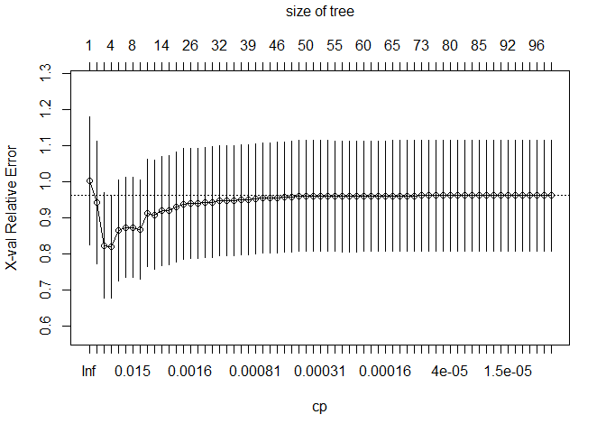

## Tree modeling: dengue cases

In all tree model, we will use the following equation:
`rpart(total_cases~ season + city + specific_humidity+tdtr_k+precipitation_amt)`
and we will use rmse to judge better performance for each model \###
import data

we first split the data set into train and test set, and do cross
validation in the train data set, then make predictions in the test data
set.

## CART

when we use `rpart` default 10-fold cross-validation, then graph the
tree plot and its X-relative error. In this case, I set if it have at
least 30 obs in a node,and the split improves the fit by a factor of
0.000002

    ## Warning: labs do not fit even at cex 0.15, there may be some overplotting

use the ‘1SE rule’ to pick a tree, create a function and choose the
smallest tree, and calculate the RMSE.

so we get the CV error is within 1 std err of the minimum level:

    ## [1] 0.09134682

prunes the tree at that level, and we get its RMSE as:

    ## [1] 38.41253

## random forests

we use the same variable as we used in CART:

we get its RMSE:

    ## [1] 36.66107

## gradient-boosted trees

we can get its RMSE as

    gbm_rmse

    ## [1] 41.30179

### model compare

so in general, we can see that random forest is better than CART and
gradient-boosted trees, and we make partial dependence plots for
`specific_humidity`, `tdtr_k`, `precipitation_amt`:

